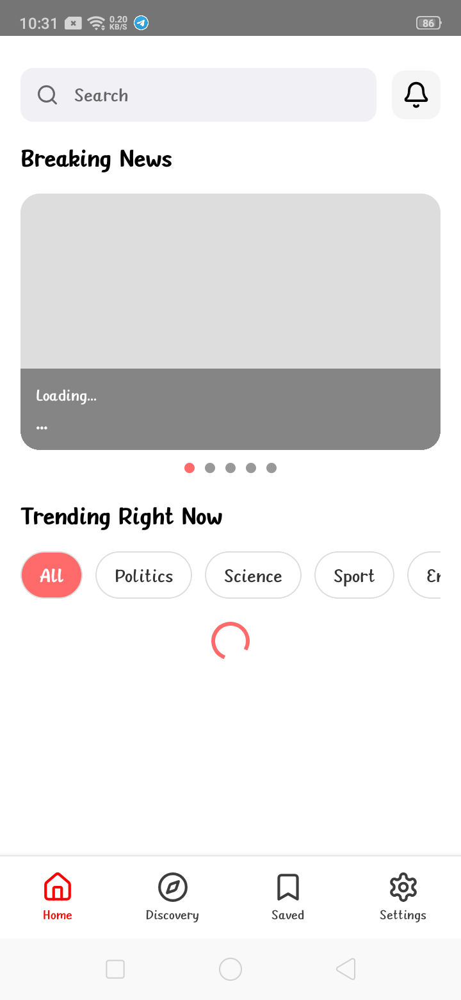
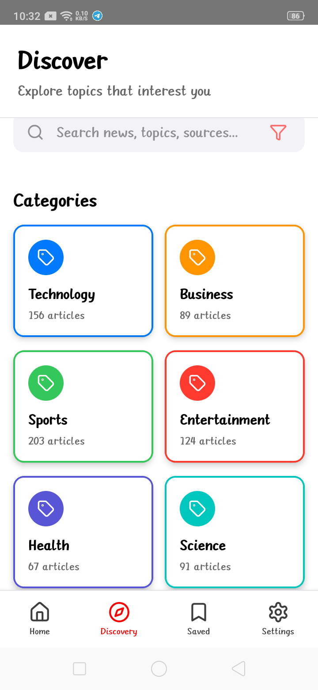
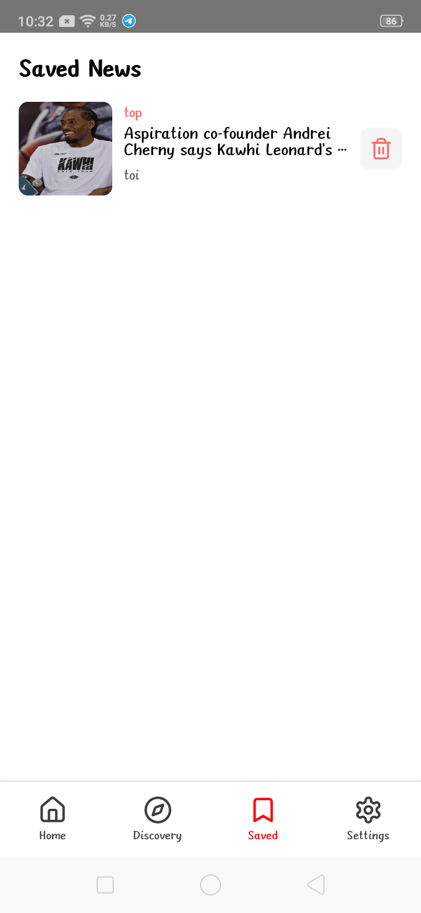
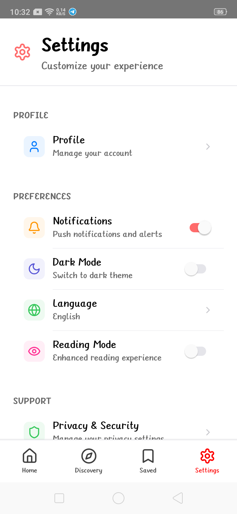

# New-App

**New-App** is a React Native starter project created using `@react-native-community/cli`.  
It includes TypeScript support, ESLint, Prettier, and the basic configuration required to run on both Android and iOS.

---

## 📌 Table of Contents
- [Overview](#overview)
- [Features](#features)
- [Project Structure](#project-structure)
- [Setup & Installation](#setup--installation)
- [Running the App](#running-the-app)
- [Code Configuration](#code-configuration)
- [Testing](#testing)
- [Dependencies](#dependencies)
- [Screenshots](#screenshots)
- [Contributing](#contributing)
- [License](#license)

---

## 📖 Overview
This is a starter React Native application with:

- TypeScript support  
- Linting (ESLint) and formatting (Prettier) pre-configured  
- Ready to build on **Android** and **iOS**  

Perfect as a base for building new cross-platform apps.

---

## ✨ Features
- 🚀 Cross-platform (Android & iOS)  
- ⚡ Fast Refresh enabled for quicker development  
- 🛠 Pre-configured ESLint + Prettier  
- 🔒 TypeScript for safer code  
- 🧪 Testing setup with Jest  

---

## 📂 Project Structure

```
New-App/
├── .bundle/
├── __tests__/               # Unit test files
├── android/                 # Native Android code
├── ios/                     # Native iOS code
├── App.tsx                  # Main app component
├── index.js                 # Entry point
├── app.json                 # App config
├── babel.config.js          # Babel setup
├── eslintrc.js              # ESLint rules
├── jest.config.js           # Jest test config
├── metro.config.js          # Metro bundler config
├── package.json             # Dependencies and scripts
├── tsconfig.json            # TypeScript settings
├── .prettierrc.js           # Prettier formatting rules
├── .watchmanconfig          # Watchman settings
└── README.md                # Project documentation
```

---

## ⚙️ Setup & Installation

1. **Clone the repository**
   ```bash
   git clone https://github.com/AbhaySharma3666/New-App.git
   cd New-App
   ```

2. **Install dependencies**
   ```bash
   # using npm
   npm install

   # OR using yarn
   yarn install
   ```

3. **(iOS only)** Install CocoaPods
   ```bash
   cd ios
   bundle install
   bundle exec pod install
   cd ..
   ```

---

## ▶️ Running the App

- **Start Metro Bundler**
  ```bash
  npm start
  # or
  yarn start
  ```

- **Run on Android**
  ```bash
  npm run android
  # or
  yarn android
  ```

- **Run on iOS**
  ```bash
  npm run ios
  # or
  yarn ios
  ```

---

## 🔧 Code Configuration
- **ESLint** rules → `.eslintrc.js`  
- **Prettier** formatting → `.prettierrc.js`  
- **TypeScript** setup → `tsconfig.json`  

---

## 🧪 Testing
Run Jest tests with:
```bash
npm test
# or
yarn test
```

---

## 📦 Dependencies
Main dependencies are defined in `package.json`. Includes:
- **React Native**
- **TypeScript**
- **Babel**
- **Metro Bundler**
- **Jest**

---

## 📸 Screenshots
> Replace placeholders with your actual screenshots.

| Screen | Description |
|--------|-------------|
|  | Splash UI of the app |
|  | Main UI of the app |
|  | Main UI of the app |
|  | Example feature screen |
|  | Save feature screen |
|  | Setting feature screen |

---
  
## 🤝 Contributing
1. Fork this repo  
2. Create a new branch (`git checkout -b feature-branch`)  
3. Commit changes (`git commit -m "Add feature"`)  
4. Push branch (`git push origin feature-branch`)  
5. Open a Pull Request  

---

## 📄 License
Specify your license here (MIT recommended).

---

## 📬 Contact
If you have any questions or suggestions, feel free to reach out.
